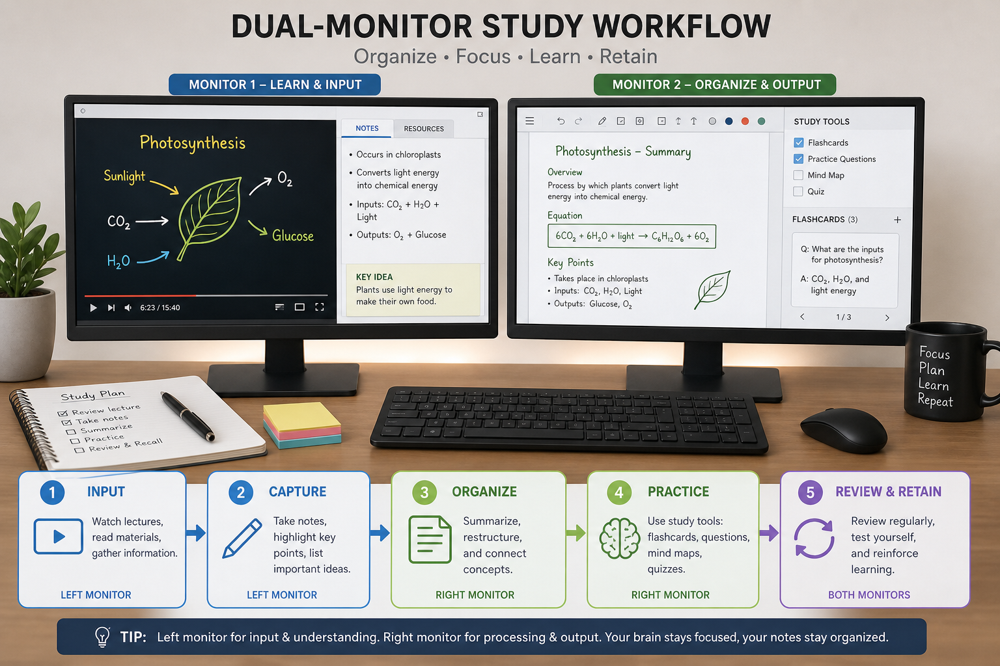
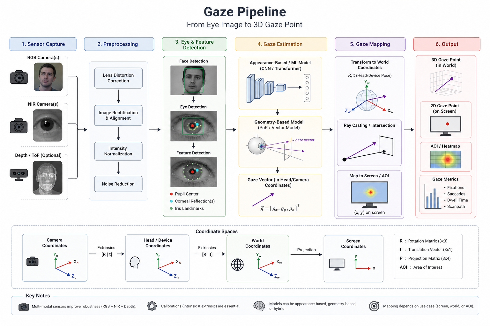
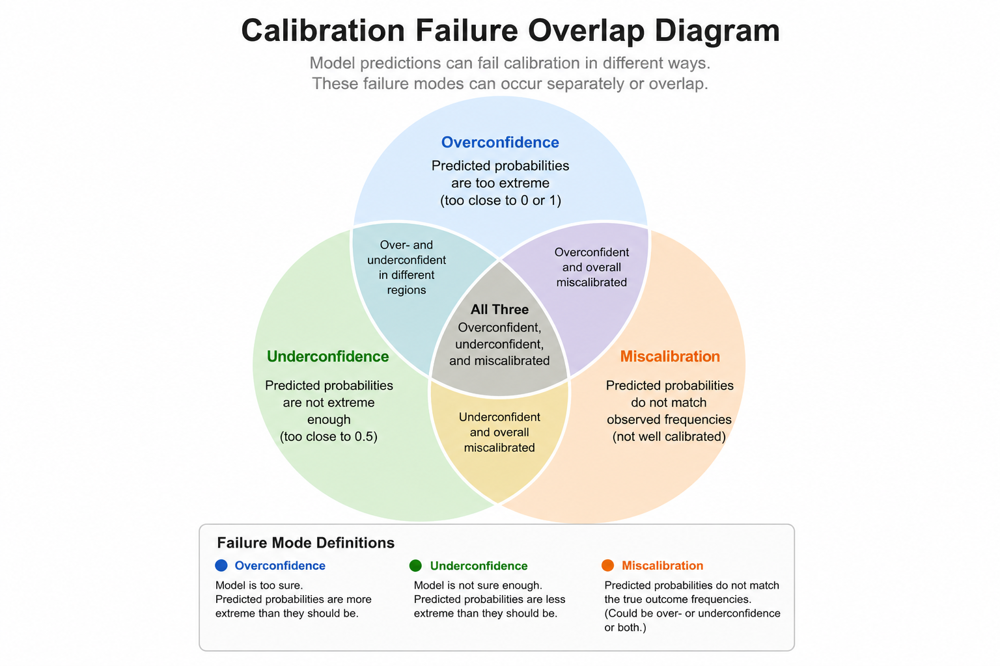
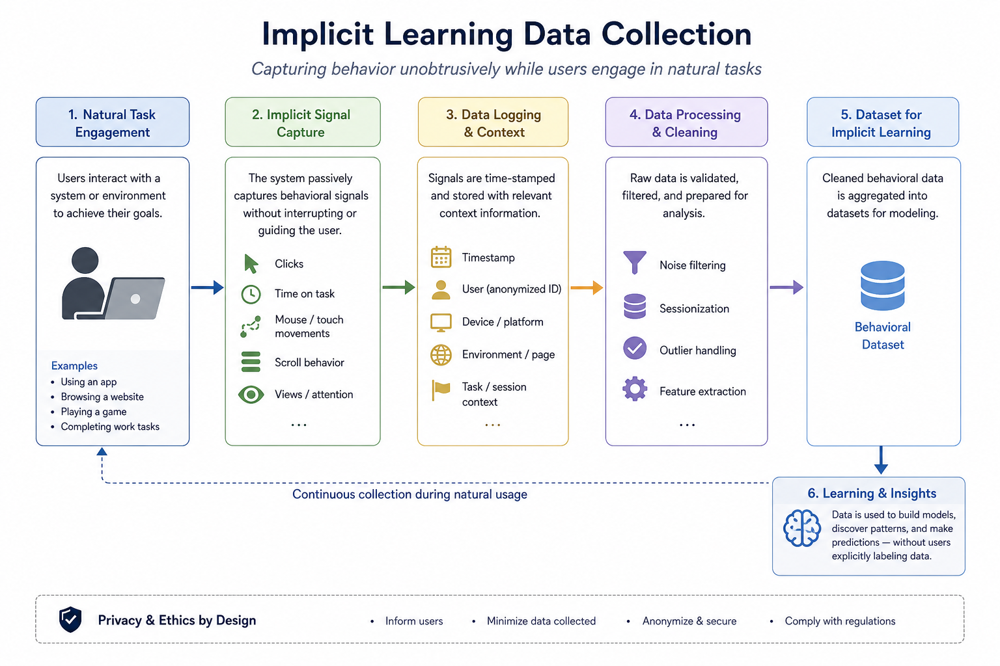

# Eye Window

**Look at a screen, type there.** Eye Window is a native macOS menu bar app that moves keyboard focus between two displays using your webcam and an on-device gaze model—so you can watch a lecture on one monitor and take notes on the other without hammering Command+Tab.



---

## The problem

Dual-monitor study and work breaks flow at the keyboard boundary. You glance at the other display, but focus stays on the app you were already typing in. You reach for Command+Tab, find the right window, click, and only then can you type. That friction adds up over a 30-minute lecture or a full study session.

Eye Window tries to remove that step: **dwell on a display → focus moves to the last app you used on that display.**

---

## What we are building

| Goal | How |
|------|-----|
| Display-level focus (not window-level) | Map gaze to **Display 1** or **Display 2**, then activate **last-focused app** on that display |
| Feel intentional, not twitchy | **Dwell** (~0.35–0.9 s, tuned per user) + **focus lock** + hysteresis |
| Private and local | Webcam + Core ML on your Mac; no cloud, no disk video |
| Works on a real desk | Per-user mapping from webcam geometry, head pose, and gaze angles |

The gaze signal is a 5-dimensional feature vector per frame:

```
[gx, gy, gz, yaw, pitch]
```

- **gx, gy, gz** — unit gaze direction from model yaw/pitch  
- **yaw, pitch** — raw model outputs (radians)



**Pipeline (simplified):**

1. Webcam at ~10 FPS (center crop; no separate face detector—keep your head in frame).
2. **MobileNetV2** gaze model ([yakhyo/gaze-estimation](https://github.com/yakhyo/gaze-estimation)) via Core ML.
3. Rolling mean over the last **8 frames** → “current” gaze vector.
4. Compare to per-display prototypes → pick nearest display → dwell → Accessibility focus switch.

---

## Why rule-based calibration is not working

We spent a long iteration on **explicit calibration**: six red dots (center / left / right on each display), ~12 s per dot, pool samples into one **mean prototype** per screen, classify at runtime with **Mahalanobis nearest-mean**, and gate quality on prototype gap and replay accuracy.

In theory this is clean. In practice it fails for most real users.



### 1. Artificial setup ≠ real usage

Calibration asks you to stare at a dot for 12 seconds. Real use is: quick glances, typing posture, leaning, one screen brighter, laptop lid angle changing. The distribution of gaze during calibration is not the distribution during a lecture.

### 2. One mean per display is too coarse

Two prototypes in 5D space cannot capture:

- Different seating positions and distances  
- Laptop + external monitor (webcam sees D1 differently than D2)  
- Head vs eye movement (model outputs head/gaze angles, not screen pixels)  
- Left vs center vs right of the same display (we added 6 dots; replay still failed)

### 3. Separation metrics do not predict success

From [docs/calibration-runs-2026-05-20.md](docs/calibration-runs-2026-05-20.md) (9 smoke-test runs on one desk):

| Observation | Detail |
|-------------|--------|
| Pass rate | **6/9 (67%)** — failures were replay &lt; threshold, not “gap too small” |
| Yaw gap vs pass | Run passed with **0.4°** yaw gap; another **failed** with **4.5°** |
| 5D Mahalanobis gap vs pass | Smallest gap (2.79) **passed**; moderate gap (3.33) **failed** |
| D1 noisier than D2 | Raw std on display 1 often **0.32–0.38** vs **0.04–0.09** on D2 |

**Prototype separation measures how far apart the means are—not whether frames were labeled consistently during the hold.** Replay accuracy (re-classifying the same session’s frames) swung from **65% to 100%** on the same hardware.

### 4. Hard thresholds are not generalizable

Rules like “prototype gap ≥ 0.15” or “yaw gap ≥ 3°” work for one desk and fail for another. Users got stuck in retry loops or finished calibration with switches that felt right sometimes and wrong other times—**fast wrong switch, then failure to hold**, or **no switch at all** when Mahalanobis distance favored the wrong display.

### 5. User experience cost

~72 seconds of dot-staring, quality gates, Recalibrate, and debug logs are acceptable for a research prototype. They are **not** acceptable for a product people will run every study session.

**Conclusion:** Rule-based “calibrate two means, nearest at runtime” is a useful **baseline and diagnostic**, not a reliable production classifier. We need **learned** boundaries fit to **real** labeled behavior.

---

## New direction: implicit learning

Instead of upfront calibration, the app now **collects labeled gaze rows while you work normally**.



| Label source | When | Display label |
|--------------|------|----------------|
| **Mouse click** | Global click (Accessibility) | Screen containing click point |
| **App focus** | You focus an app (click, Cmd+Tab, etc.) | Display where that app’s window lives |

On each label event:

1. Take the **mean gaze vector** from the last ~1 s of frames in a ring buffer (min **4** frames).  
2. Run **quality filters** (see below) — rejected labels are logged but not saved.  
3. Append one JSON line: `[gx, gy, gz, yaw, pitch, display, source, timestamp, …]`.  
4. Debounce (~0.35 s) to avoid duplicate rows.

### Training data filters

Bad rows are dropped before append (`ImplicitGazeSampleFilter`):

| Filter | Rejects when |
|--------|----------------|
| **insufficientFrames** | Fewer than 4 gaze frames in the 1 s window |
| **staleWindow** | Newest frame is older than 0.45 s (click/focus without fresh gaze) |
| **unstableGaze** | Window std too high (head moving during click; max spread 0.10, yaw 0.07) |
| **invalidFeature** | Zero gaze, or unit vector `(gx,gy,gz)` length outside 0.85–1.15 |
| **outOfRangeAngles** | \|yaw\| > 1.35 rad or \|pitch\| > 1.0 rad |
| **nearDuplicate** | Same display as last saved row and feature within 0.05 (5D distance) |
| **debounced** | Second label within 0.35 s |

Terminal: `implicit: filter unstableGaze (mouseClick)`. Menu bar: `Learning: N samples · M filtered`.

**Dataset path:**

```
~/Library/Application Support/Eye Window/implicit_gaze_dataset.jsonl
```

**Menu bar:** `Learning: N samples (D1 X · D2 Y)` — use the app; clicks and focus changes grow the dataset. **Clear learning data** resets the file.

**Next step (not yet shipped):** Train a small classifier (e.g. logistic regression, Random Forest, or XGBoost) on this file and replace nearest-mean rules for runtime switching.

Explicit **Recalibrate** (6-dot flow) remains available for experiments and comparison; it is **no longer required** to start a session.

---

## Quick start

**Requirements:** macOS 13+, Swift 5.9+ (Xcode 15+ command line tools).

```bash
swift build
swift run EyeWindowCoreSelfCheck   # unit smoke (vector, Mahalanobis, implicit store, …)
swift run EyeWindow                # menu bar app
```

Run from Terminal to see logs:

```bash
swift run EyeWindow 2>&1
```

Look for `implicit +1 D1 (mouseClick) …` or `(appFocus) …` as you work.

### Gaze smoke tests

```bash
swift run GazeSmokeTest                              # pipeline sanity
swift run GazeSmokeTest -- --live                    # 5 s webcam check
swift run GazeSmokeTest -- --calibrate               # 6-dot explicit calibration (~72 s)
swift run GazeSmokeTest -- --calibrate --save        # write calibration.json
python3 scripts/smoke_gaze_pipeline.py               # ONNX decode reference
```

Stay visible in the webcam (fixed center crop). Grant **Camera** when prompted.

---

## Permissions

| Permission | Why |
|------------|-----|
| **Camera** | Gaze model input (~10 FPS, on-device only) |
| **Accessibility** | Move keyboard focus across displays; global mouse clicks for implicit labels |

**Gaze pause:** Control+Option+` (grave)

If Camera or Accessibility is denied, the menu bar shows **Camera blocked** or **Accessibility blocked**. Reset in System Settings → Privacy & Security.

---

## Using implicit learning

1. Connect **exactly two displays** (dual-display mode).  
2. **Start session** — gaze stream runs; no calibration required.  
3. Use both screens normally: click, type, Cmd+Tab. Each click/focus change can add a labeled row.  
4. Watch **Learning: …** in the menu until you have hundreds of samples per display.  
5. Export or inspect `implicit_gaze_dataset.jsonl` for offline training (future in-app trainer TBD).

Optional: run **Recalibrate** to compare rule-based Mahalanobis switching against your growing dataset.

---

## Legacy: explicit calibration (rule-based)

Still supported for debugging and A/B comparison:

1. Three red dots per display (**center**, **left**, **right**) — ~12 s each.  
2. Pool into one mean + per-axis std per display.  
3. Quality gates: prototype gap, replay accuracy, yaw gap (see `CalibrationQuality.swift`).  
4. Runtime: 8-frame smooth → Mahalanobis nearest → dwell + hysteresis from `CalibrationTuning`.

Saved to:

```
~/Library/Application Support/Eye Window/calibration.json
```

See [docs/calibration-runs-2026-05-20.md](docs/calibration-runs-2026-05-20.md) for measured failure modes.

---

## Gaze model

| Asset | Role |
|-------|------|
| `models/mobilenetv2_gaze.onnx` | Source weights |
| `models/MobileNetV2Gaze.mlpackage` | Shipped Core ML bundle |
| `models/GAZE_MODEL_IO.md` | Input size, normalization, outputs |
| `scripts/convert_gaze_model.py` | ONNX → Core ML (maintainer) |

Regenerate after ONNX changes:

```bash
python3 scripts/convert_gaze_model.py
swift build && swift run EyeWindowCoreSelfCheck
```

---

## Project layout

| Path | Role |
|------|------|
| `Sources/EyeWindowCore/` | Gaze engine, state machine, calibration, **implicit dataset** |
| `Sources/EyeWindow/` | Menu bar UI, Accessibility focus, mouse click collector |
| `Sources/GazeSmokeTest/` | CLI calibration and live smoke |
| `Sources/EyeWindowCoreSelfCheck/` | Runnable tests |
| `docs/images/` | README diagrams |
| `docs/calibration-runs-2026-05-20.md` | Calibration post-mortem + CSV |
| `issues/` | PRD, kanban, MVP checklist |
| `CONTEXT.md` | Domain language and decisions |

---

## Privacy

- All processing on your Mac.  
- No network calls for gaze or focus.  
- Implicit dataset and calibration JSON stay under Application Support.  
- No video recording to disk (optional debug capture is a separate future issue).

---

## MVP validation

Follow [issues/MVP-SESSION-CHECKLIST.md](issues/MVP-SESSION-CHECKLIST.md) for a 30+ minute real study session once switching is driven by a trained classifier or a stable implicit baseline.

---

## Further reading

- [CONTEXT.md](CONTEXT.md) — vocabulary (dwell, focus lock, gaze stream, …)  
- [issues/prd.md](issues/prd.md) — product requirements  
- [docs/calibration-runs-2026-05-20.md](docs/calibration-runs-2026-05-20.md) — why fixed thresholds failed on one desk  
