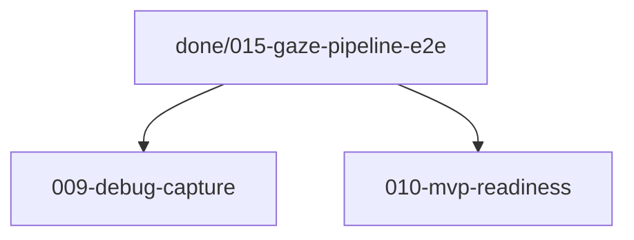

# Issue DAG

> Regenerated 2026-05-20

## Warnings

- None

## Parallel lanes (ready now)

- **Lane A:** `009-optional-debug-capture.md` (optional; after core gaze pivot)
- **Lane B:** `010-mvp-readiness.md` (manual 30+ min session on hardware)

## Stats

- Total (active): 2 | Ready (AFK): 2 | Ready (HITL): 0 | Blocked: 0
- Done (in `issues/done/`): 14 (000–008, 011–015)

## Mermaid

